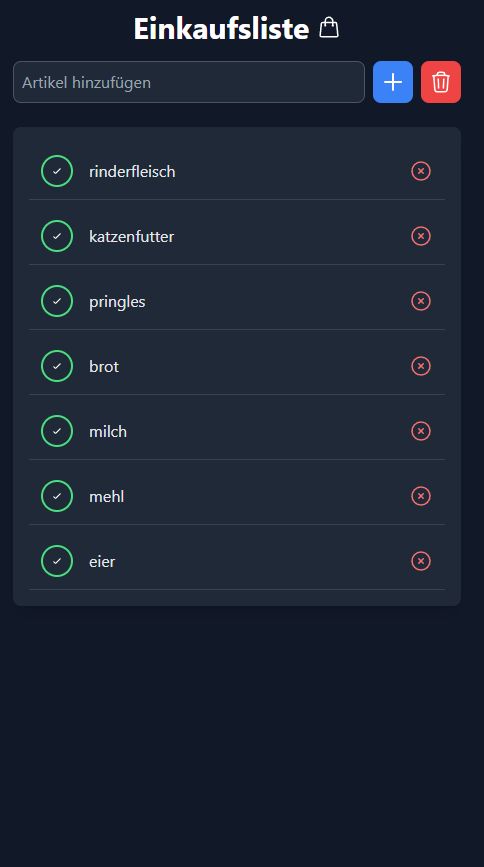

# Flask Einkaufsliste

Eine einfache Einkaufsliste basierend auf Flask, SQLite und WebSockets zur Echtzeitaktualisierung.


## Funktionen
- **Flask** als Backend
- **SQLite** als lokale Datenbank
- **WebSocket-Unterstützung** für Echtzeitaktualisierungen
- **Einfache Web-Oberfläche** für die Verwaltung der Einkaufsliste

## Installation & Nutzung

### Voraussetzungen
- Python 3
- Flask
- Flask-SocketIO
- SQLite (integriert in Python)

### Installation
1. Klone das Repository:
   ```sh
   git clone https://github.com/dein-benutzername/flask-einkaufsliste.git
   cd flask-einkaufsliste
   ```
2. Erstelle eine virtuelle Umgebung (optional, aber empfohlen):
   ```sh
   python3 -m venv venv
   source venv/bin/activate  # Linux/macOS
   venv\Scripts\activate  # Windows
   ```
   
3. Installiere die Abhängigkeiten:
   ```sh
   pip install -r requirements.txt
   ```

### Anwendung starten
Öffne ein Terminal im Projektverzeichnis und führe aus:
```sh
python3 app.py
```
Die Anwendung läuft dann lokal unter: [http://127.0.0.1:1001/](http://127.0.0.1:1001/)

## Lizenz
Dieses Projekt steht unter der GPL-3.0-Lizenz. Weitere Informationen findest du in der Datei `LICENSE`.

## Autor
[LowdFX](https://github.com/LowdFX)
